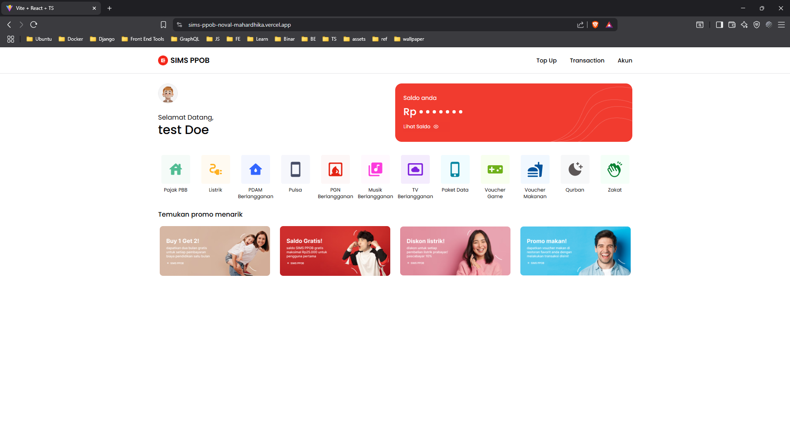

# Nutect Frontend Engineer Technical Test

This project is a frontend implementation for a technical test as a **Frontend Engineer** candidate at **Nutect**. It focuses on building a clean, scalable, and well-structured application using modern React ecosystem tools.

## 🛠 Tech Stack

- **React** — Component-based UI library
- **Tailwind CSS** — Utility-first CSS framework for styling
- **Redux Toolkit** — State management with slices and async thunks
- **React Hook Form** — Form management and validation
- **Zod** — Schema validation integrated with React Hook Form
- **TypeScript** — Type-safe development

---

## 🚀 Features

1. **User Registration** — Sign up with name, email, password, and address.
2. **User Login** — Login with persisted token (via Redux + localStorage).
3. **View Profile** — View authenticated user's profile data.
4. **Update Profile Data** — Edit first name, last name, email, and address.
5. **Update Profile Picture** — Upload and preview profile image.
6. **Top Up** — Simulate balance top-up via modal.
7. **Payment** — Pay a simulated bill or service from your balance.
8. **Transaction History** — View paginated list of top-ups and payments.

---

## 🖼️ Screenshots



---

## 📦 Installation

```bash
git clone https://github.com/novalmahardhika/sims-ppob-noval-mahardhika.git
cd sims-ppob-noval-mahardhika
npm install
```

## ⚒️ Deployment

This project is deployed on **Vercel** and accessible via the following link:

🔗 [Live Demo on Vercel](https://sims-ppob-noval-mahardhika.vercel.app)
